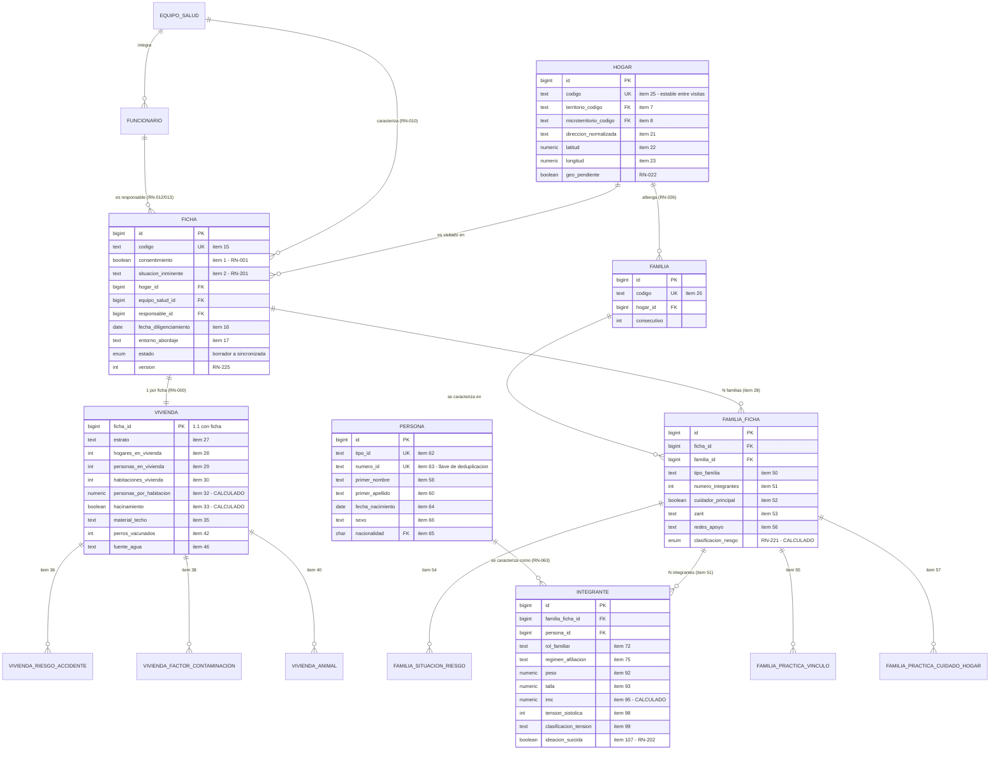
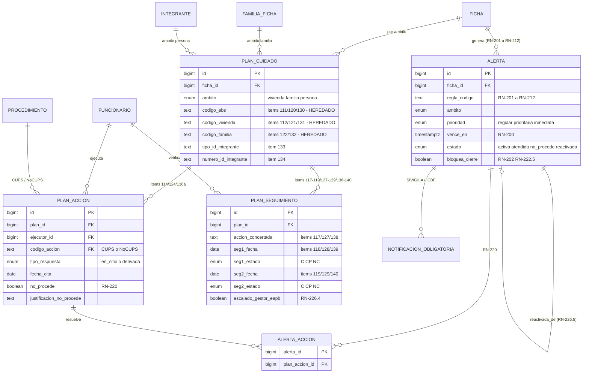
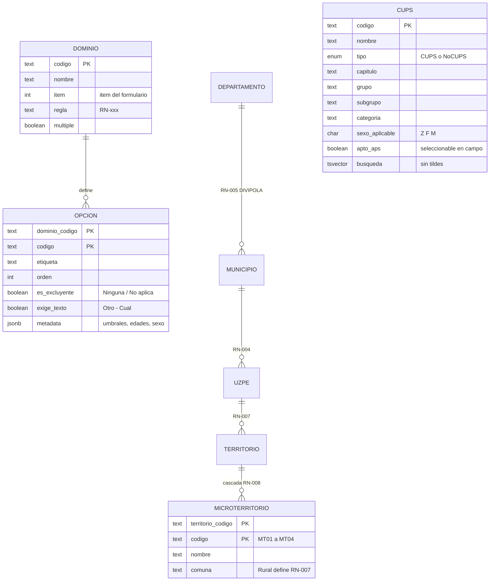
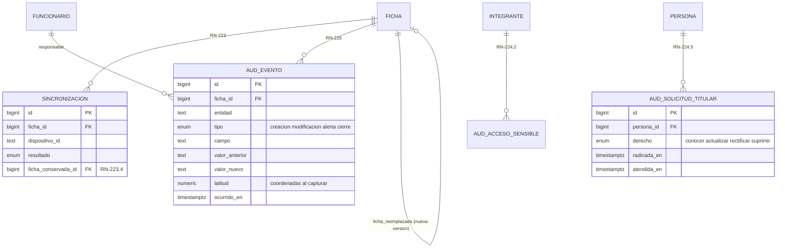

# Modelo Entidad-Relación — APS APP

**Instrumento:** SI-APS · Formulario para identificación APS – Equipos Básicos de Salud (v2 – 2025)
**Fuentes:** `REGLAS_DE_NEGOCIO.md` v2.0 (RN-000 … RN-226), `reglas.js`, `catalogos.js`
**Motor:** PostgreSQL 14+
**Ámbito:** Santiago de Cali, Valle del Cauca

| Archivo | Contenido |
|---|---|
| `01_esquema.sql` | Estructura: 54 tablas, 3 esquemas, restricciones declarativas |
| `02_catalogos_seed.sql` | 54 dominios, 442 opciones, 37 territorios, 148 microterritorios — **generado** desde `catalogos.js` |
| `03_reglas.sql` | Cálculos derivados, integridad entre tablas, validación de cierre, inalterabilidad |
| `04_cups.sql` + `cups.csv` | 10.024 procedimientos CUPS con búsqueda — **generado** desde `TablaReferencia_CUPS.xlsx` |
| `05_nocups.sql` | 20 códigos NoCUPS y 53 mapeos regla → acción esperada |
| `gen_seed.js` | Regenera `02_catalogos_seed.sql` tras cualquier cambio en `catalogos.js` |
| `gen_cups.js` | Regenera `04_cups.sql` y `cups.csv` tras una nueva publicación del MSPS |

---

## 1. Las tres decisiones que gobiernan el modelo

### 1.1 La jerarquía de RN-000 es la columna vertebral

El instrumento no es un formulario plano sino una estructura de bloques repetibles. El árbol de tablas la reproduce sin desviarse:

| Nivel | Ítems | Cardinalidad | Tabla |
|---|---|---|---|
| Ficha / Entorno | 1–20 | 1 por visita | `aps.ficha` |
| Vivienda | 21–49 | 1 por ficha | `aps.vivienda` |
| Familia | 50–57 | N por vivienda | `aps.familia_ficha` |
| Integrante | 58–110 | N por familia | `aps.integrante` |
| Plan — Vivienda | 111–119 | 1 por vivienda | `aps.plan_cuidado` (ámbito `vivienda`) |
| Plan — Familia | 120–129 | N por vivienda | `aps.plan_cuidado` (ámbito `familia`) |
| Plan — Persona | 130–140 | N por familia | `aps.plan_cuidado` (ámbito `persona`) |

La cardinalidad se hace cumplir con índices únicos parciales, no por convención:

```sql
CREATE UNIQUE INDEX ux_plan_vivienda ON aps.plan_cuidado (ficha_id)         WHERE ambito = 'vivienda';
CREATE UNIQUE INDEX ux_plan_familia  ON aps.plan_cuidado (familia_ficha_id) WHERE ambito = 'familia';
CREATE UNIQUE INDEX ux_plan_persona  ON aps.plan_cuidado (integrante_id)    WHERE ambito = 'persona';
```

### 1.2 La identidad se separa de la caracterización

Ésta es la decisión de diseño con más consecuencias, y la impone el propio instrumento:

> **RN-025.** Se conserva estable entre visitas: si el EBS regresa a la misma dirección georreferenciada, el sistema debe recuperar el hogar existente en lugar de crear uno nuevo.
>
> **RN-063.** La combinación tipo + número es la llave de deduplicación de personas entre visitas y entre hogares, de modo que una misma persona caracterizada dos veces no se contabilice como dos individuos en los indicadores poblacionales.

Por eso cada nivel se parte en dos tablas:

| Identidad (persiste) | Caracterización (por visita) | Regla |
|---|---|---|
| `aps.hogar` — código, dirección, georreferenciación | `aps.vivienda` — estrato, materiales, saneamiento, zoonosis | RN-025 |
| `aps.familia` — código subordinado al hogar | `aps.familia_ficha` — tipo, Zarit, redes, riesgo | RN-026 |
| `aps.persona` — documento, nombres, nacimiento, sexo | `aps.integrante` — rol, salud, antropometría, tamizajes | RN-063 |

Sin esta separación, la segunda visita al mismo hogar crearía un hogar nuevo, una familia nueva y personas nuevas: los indicadores de cobertura contarían dos veces a la misma población, y sería imposible comparar la evolución del riesgo entre visitas.

### 1.3 Cada selección múltiple es una tabla, nunca una lista

El instrumento tiene 22 preguntas de selección múltiple. Cada una es una tabla puente con clave primaria compuesta. Guardarlas como arreglo o como cadena separada por comas impediría lo que las reglas de decisión exigen constantemente: contar (RN-207 distingue "un síntoma" de "dos o más"), cruzar (RN-208 cruza dengue con el ítem 37) y extender al hogar (RN-208 marca a todos los integrantes como contactos de tuberculosis).

---

## 2. Diagrama — Núcleo transaccional



Las 16 tablas de selección múltiple del integrante (ítems 77–106) se omiten del diagrama por legibilidad. Todas siguen el mismo patrón: `PK (integrante_id, codigo)` con `FK` a `aps.integrante` en cascada.

---

## 3. Diagrama — Plan de cuidado, alertas y trazabilidad

Éste es el subsistema que convierte la caracterización en atención en salud. RN-220 lo resume: *"debe ser posible responder, para cualquier ficha, la pregunta: ¿qué se hizo frente a este hallazgo?"*



### 3.1 Por qué un solo `plan_cuidado` y no tres tablas

Las secciones 12.1, 12.2 y 12.3 del documento describen tres planes con estructura idéntica: ejecutor, código CUPS, tipo de respuesta, responsable de seguimiento, acción concertada y dos seguimientos fechados. Triplicar las tablas obligaría a triplicar también `plan_accion`, `plan_seguimiento`, la tabla puente con `alerta` y cada consulta de supervisión.

La discriminación por ámbito se conserva íntegra mediante el enum `ambito` y un `CHECK` que fuerza la combinación correcta de llaves:

```sql
CONSTRAINT plan_ambito_coherente CHECK (
     (ambito = 'vivienda' AND familia_ficha_id IS NULL AND integrante_id IS NULL ...)
  OR (ambito = 'familia'  AND familia_ficha_id IS NOT NULL AND integrante_id IS NULL ...)
  OR (ambito = 'persona'  AND familia_ficha_id IS NOT NULL AND integrante_id IS NOT NULL ...)
)
```

### 3.2 Las llaves heredadas se validan, no se confían

RN-130 declara que una divergencia entre los ítems 111/120/130, 112/121/131 y 122/132 **bloquea la sincronización**. El modelo materializa esas columnas (para poder auditarlas) pero las verifica contra su origen en cada escritura, mediante `aps.trg_plan_llaves_heredadas()`. Un plan cuyo `codigo_ebs` no coincida con el ítem 10 de su ficha no llega a insertarse.

El mismo trigger implementa RN-133/134: comprueba que el integrante intervenido exista **bajo la familia del ítem 132**, lo que impide registrar una intervención sobre una persona inexistente en la ficha.

### 3.3 Qué se codificó como NoCUPS y qué no

RN-114 admite dos codificaciones: CUPS para procedimientos del plan de beneficios, NoCUPS para acciones educativas, de gestión o de salud ambiental sin código asignado. Antes de crear cada NoCUPS se verificó que no existiera ya entre los 10.024 códigos oficiales, y esa verificación redujo la lista prevista.

El catálogo del Ministerio incluye dos anexos técnicos que cubren casi toda la acción educativa y ambiental — los prefijos `I` y `A`, 498 códigos:

| Código oficial | Cubre |
|---|---|
| `I11006` | Educación y comunicación para el saneamiento básico |
| `I10007` | Prevención de accidentes en el hogar |
| `I20202` | Intervención de formas inmaduras de vectores |
| `I30004` | Vinculación a otras redes de apoyo |
| `I30105` | Primeros auxilios psicológicos |
| `A31004` | Búsqueda, estudio y seguimiento de contactos |
| `I30001` | Caracterización del individuo y su entorno familiar |

Duplicarlos como NoCUPS habría roto la comparabilidad del reporte. Los 20 NoCUPS creados se limitan a lo que efectivamente no tiene código:

- **Gestión administrativa del caso** (7) — Registraduría, afiliación al SGSSS, radicado ante EAPB, Secretaría de Educación, RLCPD, asignación de cita, línea 123. Ninguno existe en CUPS porque son trámites, no procedimientos en salud.
- **Salud ambiental del predio** (8) — vacunación antirrábica animal, gestión ante prestadores de agua y aseo, reporte de asbesto, mejora locativa, control vectorial, visita de seguimiento, elementos para dormir. La zoonosis veterinaria no pertenece al CUPS humano.
- **Notificación a autoridad externa** (2) — SIVIGILA e ICBF.
- **Intervención familiar** (2) — ruta de violencias y relevo del cuidador.
- **Cierre sin intervención** (1) — `NC-NOP-01`. Existe por una razón estructural: `plan_accion.codigo_accion` es obligatorio, así que registrar un «No procede» exige un código con el cual hacerlo. Sin él, la única forma de cerrar un hallazgo que no requiere intervención sería el silencio, que RN-220 prohíbe.

### 3.4 De la obligación textual al mecanismo

Varias reglas nombran la conducta de forma expresa: RN-042 «obliga a registrar acción de canalización a vacunación antirrábica», RN-074 «exige registrar la canalización a la Secretaría de Educación», RN-209 «exigir acción de gestión de afiliación». `cat.accion_sugerida` convierte esas frases en datos — **53 mapeos regla → acción**, marcados `obligatoria` cuando la regla los nombra:

```sql
-- Lo que falta hacer frente a las alertas de una ficha
SELECT regla_codigo, accion, nota
  FROM aps.v_conducta_esperada
 WHERE ficha_id = 1 AND obligatoria AND NOT registrada;
```

Sin esta tabla, RN-220 depende de que el encuestador recuerde qué corresponde a cada hallazgo mientras busca entre diez mil códigos. Es una sugerencia operativa, no una restricción: el EBS puede registrar otra acción si el caso lo amerita.

---

## 4. Diagrama — Catálogos



### 4.1 Catálogo genérico frente a 54 tablas

Las listas cerradas del instrumento (estrato, tipo de vivienda, rol familiar, atenciones RPMS…) viven en `cat.dominio` + `cat.opcion` en lugar de 54 tablas de dos columnas. La razón es la nota de cierre de las reglas:

> Los catálogos parametrizados (territorios, EAPB, UZPE, ocupaciones CIUO, CUPS) deben administrarse por configuración y ser actualizables sin nueva versión de la aplicación.

Los catálogos con jerarquía o atributos propios (DIVIPOLA, territorios, EAPB, CIUO, CUPS) sí son tablas dedicadas, porque tienen relaciones que un catálogo genérico no puede expresar.

La validación se hace con `cat.es_opcion(dominio, codigo)` en un `CHECK` por columna. **Compromiso asumido y deliberado:** un `CHECK` con función no revalida las filas existentes cuando el catálogo cambia. Aquí eso es correcto, no un defecto — RN-225 exige que la ficha valga por el catálogo vigente el día de su captura.

### 4.2 La metadata del catálogo alimenta las reglas de decisión

`catalogos.js` ya marca sus opciones con banderas semánticas (`noSegura` en fuentes de agua, `critica` en disposición de excretas y residuos). El generador las preserva en `cat.opcion.metadata`, y la vista `aps.v_riesgo_vivienda` las lee para contar los hallazgos de RN-211. El umbral sanitario queda así en el catálogo y no escrito dentro de una vista.

Ese mismo campo es donde debe cargarse la matriz edad/sexo de RN-087, que hoy queda pendiente (ver sección 7).

---

## 5. Diagrama — Auditoría y sincronización



`aud.evento` y `aud.acceso_sensible` rechazan `UPDATE` y `DELETE` por trigger. `aps.ficha` rechaza el borrado y la modificación de sus campos estructurales una vez sincronizada: las correcciones se hacen creando una versión nueva que apunta a la anterior mediante `ficha_reemplazada_id`.

---

## 6. Dónde vive cada regla

### 6.1 Reglas resueltas por estructura o restricción declarativa

| Regla | Implementación |
|---|---|
| RN-000 | Árbol de tablas + índices únicos parciales por ámbito de plan |
| RN-001 | `ficha.consentimiento` + `CHECK ficha_sin_consentimiento` |
| RN-005 | `CHECK municipio_pertenece_departamento` y `ficha_divipola_coherente` |
| RN-008 | FK compuesta a `cat.microterritorio(territorio_codigo, codigo)` |
| RN-010 | `CHECK ebs_formato_codigo` — 3 a 20 alfanuméricos |
| RN-013 / RN-063 | `CHECK` de formato por tipo de documento |
| RN-018 | `CHECK ficha_institucion_condicionada` |
| RN-022 / RN-023 | Rangos + `CHECK hogar_geo_par` (nunca una coordenada sin la otra) |
| RN-028 a RN-031 | `CHECK` de mínimos en `aps.vivienda` |
| RN-032 / RN-033 | Columnas `GENERATED ALWAYS AS ... STORED` |
| RN-042 / RN-044 | `CHECK` vacunados ≤ total |
| RN-045 | `CHECK viv_carnet_no_aplica` |
| RN-053 | `CHECK ff_zarit_condicionado` — Zarit si y sólo si hay cuidador |
| RN-076 / RN-209.2 | `CHECK int_eapb_condicionada` |
| RN-080 | `CHECK int_pueblo_etnico_condicionado` |
| RN-095 | Columna generada `imc` |
| RN-098 | `CHECK int_tension_par` y rango fisiológico |
| RN-109 | `CHECK int_puntajes_condicionados` + rangos CRAFFT/AUDIT/ASSIST |
| RN-122 | Índice único parcial de plan familiar por familia |
| RN-226.2/4 | `CHECK seg2_posterior`, `seg1_nc_motivado`, `seg2_nc_motivado` |

### 6.2 Reglas que exigen función o disparador

| Regla | Objeto |
|---|---|
| RN-016 | `aps.trg_ficha_fecha()` — no futura, no más de 30 días al sincronizar |
| RN-064 | `aps.trg_persona_fechas()` + `aps.v_integrante_edad` |
| RN-099 | `aps.clasificar_tension()` — AHA 2024 |
| RN-130/131/132/133/134 | `aps.trg_plan_llaves_heredadas()` |
| RN-200 | `aps.plazo_prioridad()`, `aps.prioridad_maxima()`, `trg_alerta_prioridad` (no editable a la baja) |
| RN-211 | `aps.v_riesgo_vivienda` — recuento de hallazgos concurrentes |
| RN-220 | `aps.alerta_accion` + `aps.v_alertas_sin_accion` |
| RN-221 | `aps.calcular_riesgo_familiar()` + recálculo automático |
| RN-222 | `aps.validar_cierre()` — devuelve bloque, regla, ítem y detalle |
| RN-225 | `trg_ficha_inalterable`, `aud.trg_solo_insercion` |
| RN-226.1/5 | `trg_seguimiento_fechas`, `trg_seguimiento_nc_reactiva` |

### 6.3 Reglas que la base deliberadamente no impone

El documento distingue **Bloqueo** de **Advertencia** (sección 1.3). La base implementa los bloqueos; las advertencias pertenecen a la capa de captura, que pide confirmación y permite continuar. Imponerlas en la base rechazaría casos que las propias reglas admiten como legítimos:

> **RN-064.** Las inconsistencias de NV, RC, TI y CC se resuelven con advertencia y confirmación, no con bloqueo, porque existen casos legítimos de trámite pendiente: un niño de 8 años que aún no ha tramitado la TI, o un joven de 18 que no ha renovado la CC, son situaciones frecuentes en territorio y no deben impedir la caracterización.

Quedan por tanto fuera de la base: la coherencia edad/documento de NV, RC, TI y CC; el recuadro municipal de RN-022/023 (advierte, no bloquea); los valores atípicos de RN-029 y RN-041; y la contradicción de carné de RN-045.

Tampoco se modelan como restricción las **habilitaciones condicionadas por edad** (ítems 91, 94, 97, 98, 105–109). La razón la da RN-051.2: *"Un menor de 6 meses no responde tensión arterial y eso no lo hace incompleto"*. Un `NULL` en esas columnas es una respuesta válida y esperada; convertirlo en error impediría capturar niños.

---

## 7. Puntos abiertos para revisión

### 7.1 Resueltos en esta revisión

| Punto | Resolución |
|---|---|
| **UZPE** | El catálogo queda sólo con `UZPE006`, la del despliegue actual. Habilitar otra es un `INSERT` en `cat.uzpe`, sin cambio de esquema. |
| **Ruralidad del territorio** | Se deriva del Anexo A: un territorio es rural cuando sus microterritorios llevan `comuna = "Rural"`. Resultado: **30 rurales (T55–T84), 7 urbanos (T48–T54)**. La coherencia con el ítem 6 la impone `aps.trg_hogar_territorio_area()`. |
| **Matriz edad/sexo de RN-087** | Ya estaba en `catalogos.js` como `rangos` (en meses), `sexos`, `gestante` y `mujerEdadFertil`, y el seed la había cargado en `cat.opcion.metadata`. Ahora se aplica: `cat.atencion_rpms_exigible()`, `aps.atenciones_rpms_exigibles()` y un disparador que rechaza pendientes fuera de perfil. |
| **Catálogo CUPS** | Cargado desde `TablaReferencia_CUPS.xlsx`: **10.024 procedimientos** con jerarquía oficial y búsqueda de texto. |
| **Códigos NoCUPS** | 20 códigos creados en `05_nocups.sql`, limitados a lo que el catálogo oficial no cubre. Ver sección 3.3. |

Sobre los nombres de territorio: el instrumento no les asigna denominación propia. El Anexo A los identifica sólo por código (`T48`–`T84`) y nombra los microterritorios, que es donde está el topónimo real —San Cayetano, Siloé, Kilómetro 18—. `cat.territorio.nombre` queda igual al código, que es lo que la fuente dice.

### 7.2 Abiertos

1. **Subconjunto de CUPS apto para campo.** Los 10.024 códigos incluyen procedimientos como «exenteración pélvica», sin sentido en una visita domiciliaria. `05_nocups.sql` deja marcados con `apto_aps` los 44 códigos que alguna regla invoca —20 NoCUPS y 24 CUPS oficiales—, que es el mínimo defendible. Falta que la Secretaría defina el resto del subconjunto; hasta entonces el selector debe ofrecer también el catálogo completo, porque 44 códigos no cubren toda la práctica de un EBS.

2. **Catálogo CIUO.** `cat.ocupacion_ciuo` está vacía. RN-073 admite texto libre como alternativa (`ocupacion_texto`), así que no bloquea la captura, pero impide el análisis de riesgo ocupacional que la regla recomienda.

3. **Cifrado de datos sensibles (RN-224.2).** El modelo marca los campos sensibles y audita su consulta, pero el cifrado en reposo no está resuelto en el DDL. Son dos caminos: `pgcrypto` a nivel de columna, que cifra sólo lo sensible pero impide indexar y buscar por esos campos; o cifrado de disco o instancia, transparente para las consultas pero menos protector frente a un acceso con credenciales válidas. **Recomiendo cifrado de instancia más el control de acceso por territorio de RN-224.3**, porque el riesgo real que describe la regla es el acceso indebido de personal autorizado a fichas de territorios que no le fueron asignados, y contra eso `pgcrypto` no protege.

---

## 8. Instalación

```bash
createdb aps_encuesta
cd bd
psql -d aps_encuesta -f 01_esquema.sql
psql -d aps_encuesta -f 02_catalogos_seed.sql
psql -d aps_encuesta -f 03_reglas.sql
psql -d aps_encuesta -f 04_cups.sql     # desde bd/: usa \copy con ruta relativa
```

El orden es obligatorio: `03_reglas.sql` define disparadores sobre tablas de `01`, y el trigger `trg_ficha_fecha` lee el parámetro `dias_maximos_ficha` que siembra `02`. El paso 4 debe ejecutarse desde el directorio `bd/` porque `\copy` resuelve `cups.csv` en el directorio de trabajo del cliente.

Para regenerar los datos desde sus fuentes:

```bash
node bd/gen_seed.js    # tras editar catalogos.js
node bd/gen_cups.js    # tras una nueva publicación de CUPS del MSPS
```

### Consultas de verificación

```sql
-- Qué falta para cerrar una ficha (RN-222)
SELECT * FROM aps.validar_cierre(1);

-- Alertas sin conducta registrada (RN-220)
SELECT * FROM aps.v_alertas_sin_accion;

-- Viviendas de alto riesgo sanitario: tres o más hallazgos (RN-211)
SELECT * FROM aps.v_riesgo_vivienda WHERE hallazgos >= 3;

-- Semaforización del riesgo familiar (RN-221)
SELECT fa.codigo, ff.clasificacion_riesgo
  FROM aps.familia_ficha ff JOIN aps.familia fa ON fa.id = ff.familia_id;

-- Selector de acciones del Plan de Cuidado: busca sin tildes ni mayúsculas
SELECT * FROM cat.buscar_cups('vacunacion antirrabica');
SELECT * FROM cat.buscar_cups('citologia', 10, 'mujer');

-- Atenciones RPMS exigibles para un integrante según su edad y sexo (RN-087)
SELECT * FROM aps.atenciones_rpms_exigibles(1);
```
